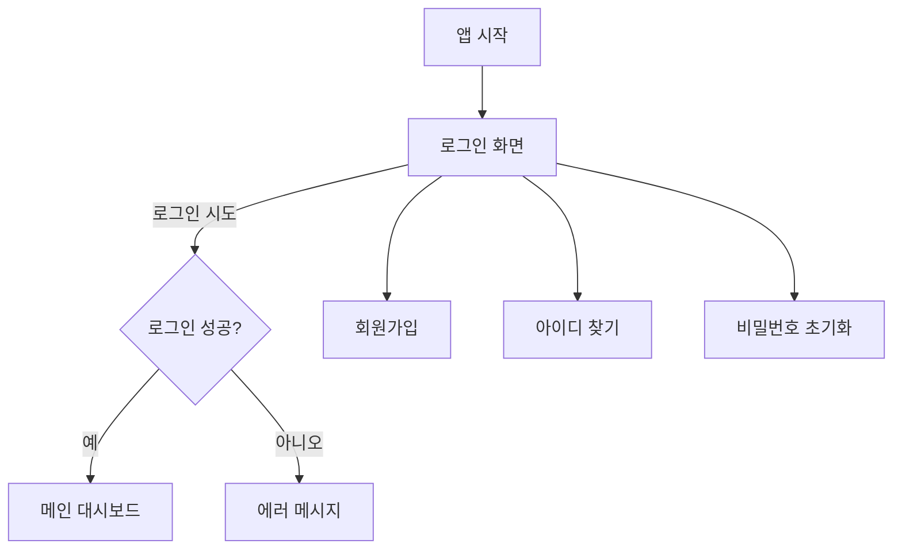
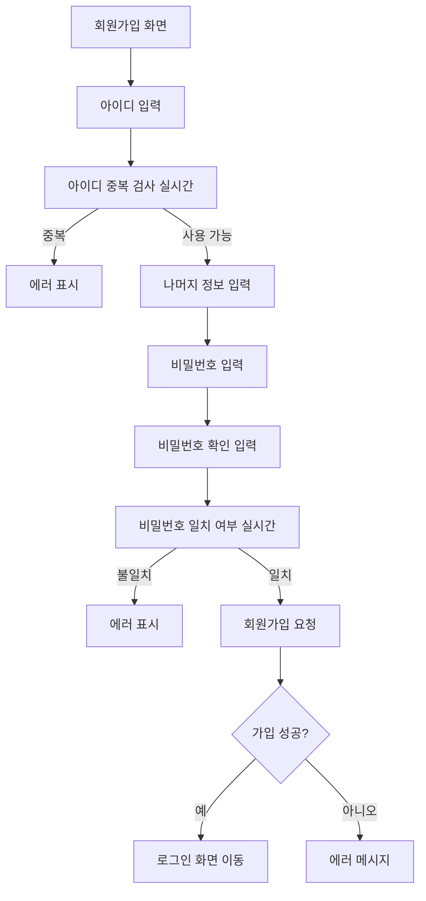
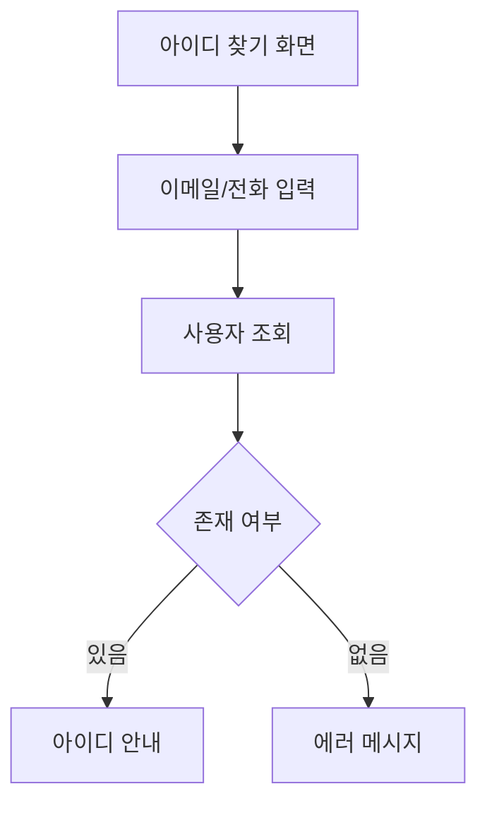
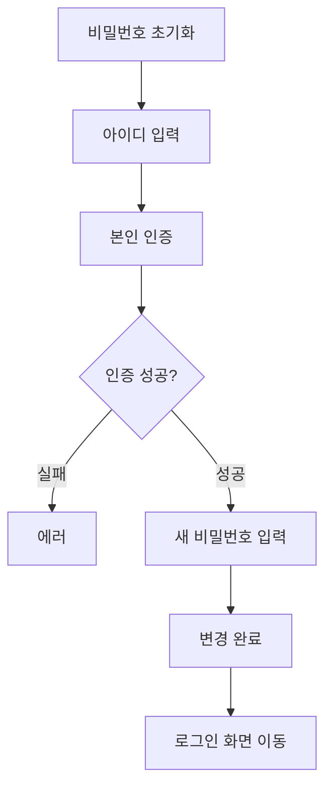

### 로그인 프로세스

```mermaid 
flowchart TD
    A[앱 시작] --> B[로그인 화면]

    B -->|로그인 시도| C{로그인 성공?}
    C -->|예| D[메인 대시보드]
    C -->|아니오| E[에러 메시지]
    B --> F[회원가입]   
    B --> G[아이디 찾기]
    B --> H[비밀번호 초기화]
```

### 회원가입 프로세스

```mermaid
flowchart TD
    A[회원가입 화면] --> B[아이디 입력]

    B --> C[아이디 중복 검사 실시간]
    C -->|중복| D[에러 표시]
    C -->|사용 가능| E[나머지 정보 입력]

    E --> F[비밀번호 입력]
    F --> G[비밀번호 확인 입력]

    G --> H[비밀번호 일치 여부 실시간]
    H -->|불일치| I[에러 표시]
    H -->|일치| J[회원가입 요청]

    J --> K{가입 성공?}
    K -->|예| L[로그인 화면 이동]
    K -->|아니오| M[에러 메시지]
```

### 아이디 찾기

```mermaid  
flowchart TD  
A[아이디 찾기 화면] --> B[이메일/전화 입력]  
B --> C[사용자 조회]  
C --> D{존재 여부}  
D -->|있음| E[아이디 안내]  
D -->|없음| F[에러 메시지]
```

### 비밀번호 초기화

```mermaid  
flowchart TD  
A[비밀번호 초기화] --> B[아이디 입력]  
B --> C[본인 인증]  
C --> D{인증 성공?}  
D -->|실패| E[에러]  
D -->|성공| F[새 비밀번호 입력]  
F --> G[변경 완료]  
G --> H[로그인 화면 이동]
```

